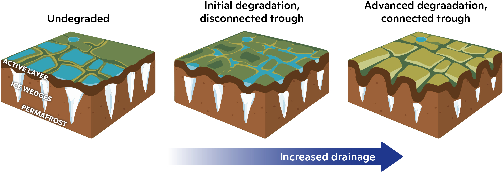
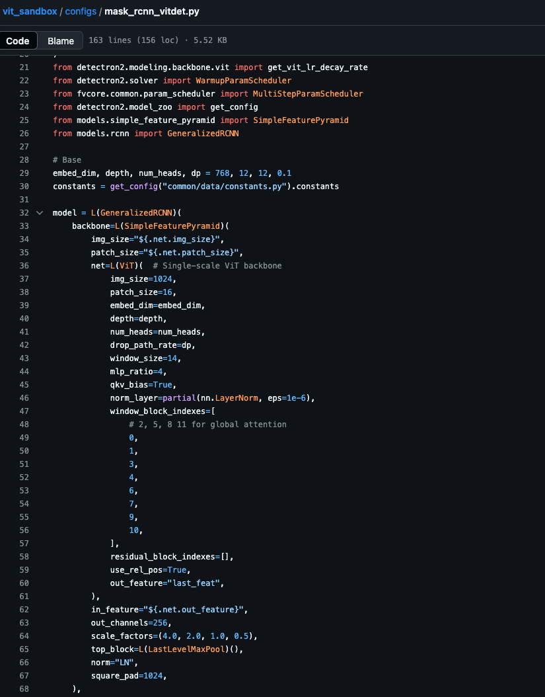
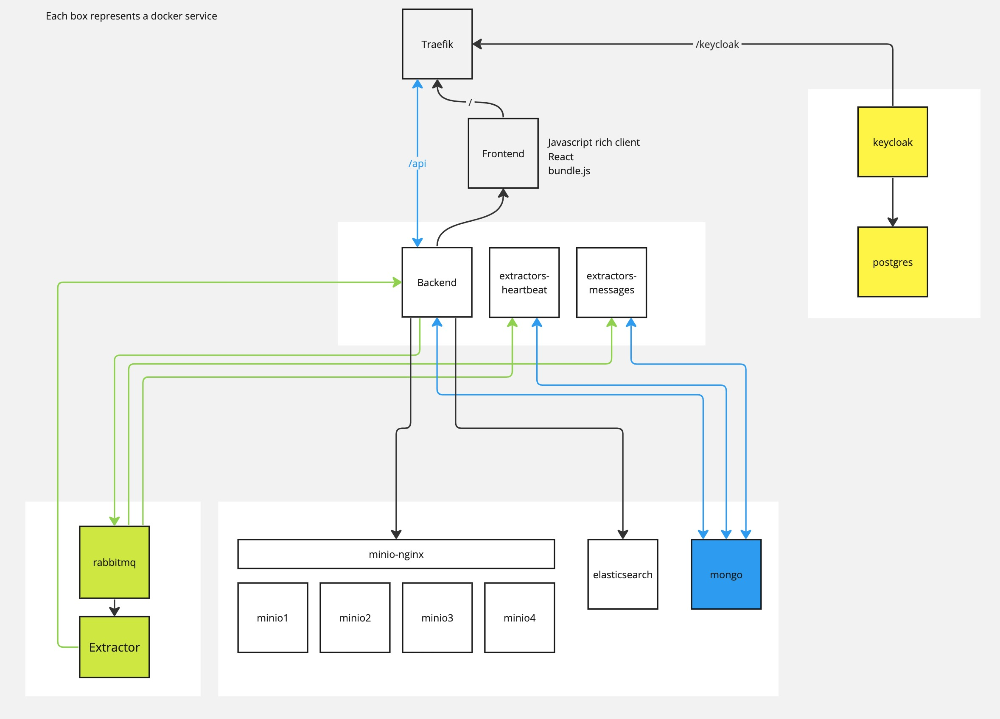
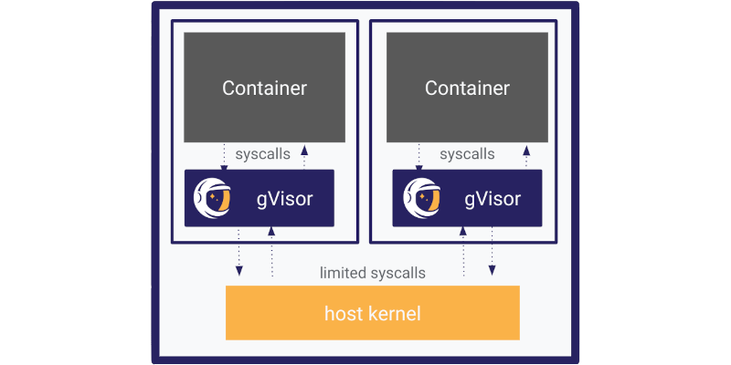
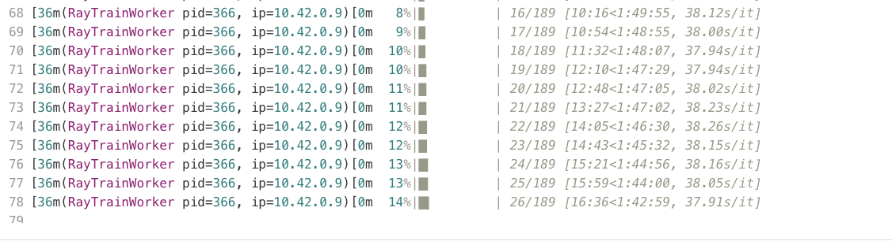
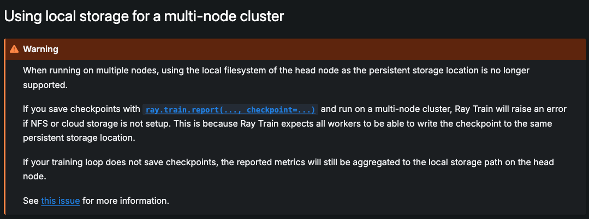
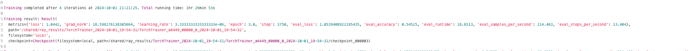

# IBM HDC

## Machine Learning Pipeline Deployment on Clowder

Last week, I was able to run a PDG ML pipeline that one of the scientists, Amal helped me run through. The pipeline utilizes ViTs through Detectron2 to train a model to detect IWP (Ice Wedge Polygons) in satellite images. 

**Quick Intro to Ice Wedge Polygons (IWP)**

Ice wedges are one of the three main features of the Arctic’s land surface. Permafrost, ground that remains below 0˚C for at least two consecutive summers, lies under a thinner layer of thawing and refreezing soil, called the active layer. When permafrost cracks during cold winter days, snowmelt and runoff water seep into the empty space. These eventually freeze and create a wedge-shaped spear of ice that extends vertically down into the permafrost.

Ice wedges actively re-shape the tundra. When they freeze, they grow and expand outward, pushing against the bordering permafrost and active layer. With nowhere else to go, permafrost and soil push upwards, and ridges form on the surface of the tundra. The ridges interlock and form distinct shapes, referred to as ice-wedge polygons. 

**Back to the pipeline**

While ensuring scalabilty of the pipeline on Cloudm the main purpose of our thrust is to  *simplify a scientific computing application developer’s process of moving ML training/inference pipelines across computational resources via the hybrid cloud*.

Our current approach to pipelines have not taken into account, a scientist's need to modify configurations and code during the training process. This is a common practice in ML where the user may want to change hyperparameters, model architecture, or other configurations during training.

To give users the power of modifying configurations and code during the training process, we need to build a system that can handle this. I have come across a few approaches with their pros and cons:

- **Approach 1**: Direct code injection into the container. This is the most straightforward approach. The extractor can load the file passed by the user and run it in a container but even this is risky. Container escape is a real possibility (I am no expert but here is a useful [link](https://www.panoptica.app/research/7-ways-to-escape-a-container) in some of the methods)

- **Approach 2**: Running the code in a sandbox environment using a tool like gVisor. This is a more secure approach. gVisor is an open-source container runtime that implements an additional kernel layer between the container and host OS. This way, even if the container is compromised, it cannot affect the host machine. However, the shortcomings here are that we don't have control over the code that is being run. It might not affect our system but could be code that is wasting resources for unapproved purposes.

- **Approach 3**: Using a JSON file to pass configurations. This is the most secure approach. The user can pass a JSON file with configurations and the extractor can read this file and run the model. This way, the user cannot run arbitrary code. However, this approach is not flexible. The number of hyperparameters that can be passed is a very extensive list and to have our extactor code to be able to handle all of them is a challenge.

- **Approach 4**: The code can be restricted to use only certain libraries. This is a more secure approach. The user can only use the libraries that are whitelisted. This way, the user cannot run arbitrary code. They are limited by the whitelist libraries but in most cases, this is enough. The user can still change hyperparameters and other configurations.

## Infrastucture building for running ML on Kubernetes through Clowder [WIP]

**Problem Statement** - The goal is to allow users to run ML models on Clowder for inference and finetuning. The incentive should be it is easier than the system they currently have. The user should be able to upload large datasets easily, run models on an environment that is reproducible and scalable, and get the results back in a timely manner. Depending on the process, we need to have a system that can allocate resources dynamically. For example, finetuning a model may require a GPU. Another issue is that during ML processes a lot of configurations need to be actively changed by the user. This might require code injection. To protect the system from possible attacks, we need to have a system that can handle this. To summarize, Clowder needs to have the following features:

- **Reproducibility**: The system should be able to run the same model with the same results.
- **Scalability**: The system should be able to allocate resources dynamically.
- **Security**: The system should be able to handle code injections and other attacks.
- **Ease of Use**: The system should be easy to use for the user.

## Security
To address the issues with security, I looked into the [practices of Colab](https://expertbeacon.com/is-google-colab-safe-an-experts-perspective-on-the-security-of-the-leading-data-science-platform/) and Leetcode which run code provided by user. The common idea is to run the code in a sandbox environment. This is a secure environment that can be easily reset. The code is run in a container that is isolated from the host machine. This way, even if the code is malicious, it cannot affect the host machine. We already do this in Clowder, where each extractor is run in a container. However, we need to make sure that the container is isolated from the host machine.

In Google colab, the notebook code itself executes within a secure container running on the VM, isolated from the host machine as well as other users‘ containers. Google achieves this using gVisor, an open-source container runtime that implements an additional kernel layer between the container and host OS.

**[gVisor](https://gvisor.dev/)**

Key points:

- gVisor provides a strong layer of isolation between running applications and the host operating system. It is an application kernel that implements a Linux-like interface. Unlike Linux, it is written in a memory-safe language (Go) and runs in userspace. Basically, it is like a lightweight VM (but not a VM! It is a container so more lightweight) that runs on the host machine which runs the containers. Previously, the containers could directly make calls to the kernel, but now they have to go through gVisor. This way, even if the container is compromised, it cannot affect the host machine.

- From the home page "Isolate Linux hosts from containers so you can safely run user-uploaded, LLM-generated, or third-party code."

- gVisor applications can use CUDA on Nvidia GPUs, bringing isolation to AI/ML workloads.

- gVisor works with Docker, Kubernetes, and containerd.

Before gVisor, I read about seccomp, which allows us to filter system calls. But as gVisor says in its docs, "These schemes typically rely on hooks implemented inside the host kernel to enforce the rules. If the surface can be made small enough, then this is an excellent way to sandbox applications and maintain native performance. However, in practice it can be extremely difficult (if not impossible) to reliably define a policy for arbitrary, previously unknown applications, making this approach challenging to apply universally."

gVisor may be thought of as either a merged guest kernel and VMM, or as seccomp on steroids. This architecture allows it to provide a flexible resource footprint (i.e. one based on threads and memory mappings, not fixed guest physical resources) while also lowering the fixed costs of virtualization.

## Code Analysis

For python code, we can use [Bandit](https://bandit.readthedocs.io/en/latest/) to check for security issues. Bandit is a tool designed to find common security issues in Python code.

What to research?

How do we integrate gVisor with Clowder? Do we only run extractor containers with gVisor?

## Scalability

## Proposed Roadmap

Our roadmap to run a PDG finetuning and inference on Clowder will have the following steps:

- An extractor that will run on a K8 cluster (maybe a GPU environment in the start) for finetuning or inference. The user will be unable to change configurations or code. The users we are aiming for are those who have just a dataset and want to train it. 

- We develop extractors with gvisor, once this is done, users can pass config python files through Clowder and run the extractors on the cluster.

- Creating an online file editor options include [Codeium](https://github.com/Exafunction/codeium-react-code-editor), [react-simple-code-editor](https://github.com/react-simple-code-editor/react-simple-code-editor), or the most popular [react-monaco-editor](https://github.com/react-monaco-editor/react-monaco-editor). Monaco editor is used in VScode. The user can edit the code, save the file and submit to the extractor. Also look into this [post](https://betterprogramming.pub/embedding-a-monaco-editor-inside-react-app-37083cf829e9)

## Problems we need to think about

- What happens if two users edit the same file at the same time?
- How to handle network access from extractors? Prevent downloading file fron the extractors?
- Restricting access to the isolating environment
- 

## KubeRay Experiments

### 1. Introduction to Kubernetes and Ray
I began by familiarizing myself with Kubernetes and Ray, focusing on running Luigi's Clowder extractors for image classification on a Ray Cluster deployed on Kubernetes. The extractors utilized the Ray Job API to submit tasks to the cluster. After minor adjustments, the extractors ran successfully on the cluster.

### 2. Shift to Training Jobs on Ray Cluster
The project shifted towards training models on the Kubernetes cluster. Since our K8s cluster lacks GPUs, I followed CPU-based examples from the Ray documentation. I ran the [KubeRay MNIST training job](https://docs.ray.io/en/latest/cluster/kubernetes/examples/mnist-training-example.html#kuberay-mnist-training-example) on the PDG cluster but encountered resource allocation issues.

An error occurred due to the `/tmp` directory overspilling. While one solution was to mount a volume to the pods, I first attempted increasing the memory allocation of worker nodes from 4 GiB to 24 GiB, similar to Luigi's setup. This adjustment resolved the issue, and the job ran successfully, albeit slowly, with each epoch taking around 5 minutes (10 epochs in total).

### 3. Modifying Existing Training Extractor for Ray Cluster

I proceeded to modify the previous Clowder extractor, which was designed to train foundation models using Hugging Face transformers, into a RayCluster job. The original job ran on a GPU environment, but the goal is to achieve comparable speeds using KubeRay.

As a side note, I tried improving the script's performance by using Ray Datasets to load the data. The script also had more specificity regarding workers and batch sizes. However, I encountered issues I was unable to resolve so thought I pivot to a more basic script and come back to this later.

- **Deployment on K8s**: During deployment, I encountered several issues:
    - Environment and coding errors arose early on.
    - I got it working with the BERT model but that was taking a long time for just a small sample of the data

    

    -**Switch to a Smaller Model:** I switched to using [Tiny-Bert](huggingface.co/prajjwal1/bert-tiny) to reduce the timing issue, however ran into some issues with input dimensions. The fix was to set the `max_length` parameter and use padding to ensure the input tensor lengths matched. 
    
    - **Storage Issues:** I encountered storage issues and realized we needed a shared storage resource for the worker nodes. I created a Taiga mounted PVC and mounted it to the worker nodes, which resolved the issue. Thank god, we shifted to a smaller model or we would have taken a long time to run into this issue.

    

The model was then able to train successfully though the accuracy was low due to the small dataset size, the model's simplicity.

### Takeaways and next steps:

- I am currently using a RayJob, but when using extractors we will need to submit jobs to a RayCluster. Luigi has already done something similar on the inference extractor so this should be an easy transition.

- Working on this script, I realized we need to give users control over more minute configuration details such as tokenization parameters. It does not need to be resolved now but it is something to keep in mind.

- The exporting of the best model from this cluster back to Clowder (is probably straightforward using the Clowder API)  

- Need to see how it handles pod failures

- How easily can the script be ported to a GPU environment?

- **Autoscaling** - Dynamic resource allocation based on the load for large datasets and models

- **Model Versioning** - Implementing a versioning system for models to track changes and improvements. Can users pick the best model from the cluster and export it back to Clowder?

