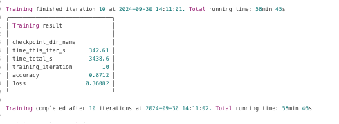

# IBM HDC

## KubeRay Experiments

Add experience running RayCluster job on Luigi's hugging face code

- Was running this [KubeRay job example](https://docs.ray.io/en/latest/cluster/kubernetes/examples/mnist-training-example.html#kuberay-mnist-training-example) on PDG cluster and ran into some issues with resource allocation.

- I got an error that the /tmp was overspilling. I looked up online and it said I can mount a volume to the pods so that ray writes to the volume instead. I have done something similar when running on GPU VM. I noticed though Luigi was able to run the cluster in his repo by giving a higher memory allocation in the yaml (increased memory of worker nodes from 4 - 24 gik) and thought it should be worth the first try instead. I tried that and it worked. I am running the job now and it seems to be going smoothly though slow. I think there are 10 epochs with each epoch taking about 5 minutes. 

- Now my next course of action was to modify, the previous extractor I wrote in clowder, which helps train foundation models using Hugging Face transformers for a specific task, into a RayCluster job. 

- The job previously ran on a GPU environment but the aim is to get near similar speeds with KubeRay. I will first start with a specific script before moving to using Clowder Extractor to provide the input, output and starting the job