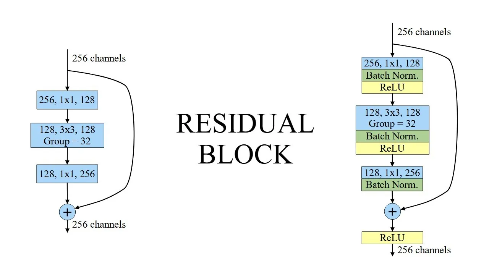
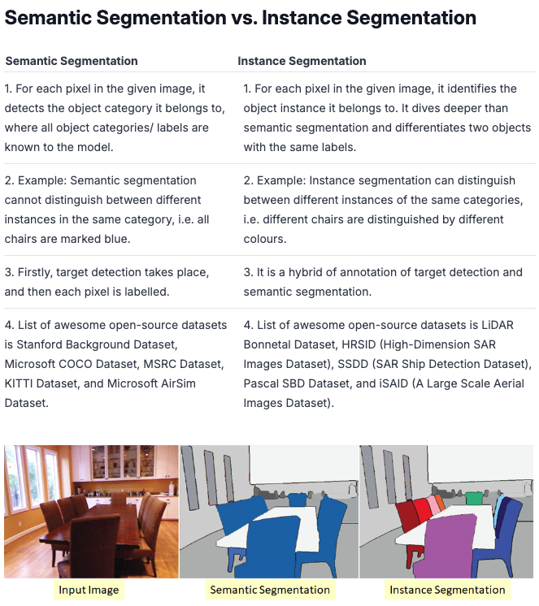

# Personal Research and Study

## Running the PDG ViT Model

Using the Vision Transformer in Detectron2 which is already pre-trained. 

Datasets:
- Each dataset has a testm train and val folder
- iwp stands for ice wedge polygon
- infrastrucutre helps to identify infrastructure in the images

Each dataset has a corresponding config file in the `configs` folder. Each config has pixel mean and pixel_std. This helps with normalization of the images. Each channel has its own mean and std.

**Pytorch needs to be configured for our environment**
`conda install pytorch torchvision torchaudio pytorch-cuda=12.4 -c pytorch -c nvidia`

## Computer Vision Neural Network Terms
*[Source](https://medium.com/@shroffmegha6695/know-your-neural-network-architecture-more-by-understanding-these-terms-67faf4ea0efb)*
**Backbone**

The Backbone Network are commonly seen in the Object detection model architectures. Backbone is responsible for extracting and encoding features from the input data. It acts as the core feature extractor, capturing low-level and high-level features from the input data.

**Baseline**

The baseline model is a simple reference model used for comparison, whereas the backbone model is a more complicated architecture responsible for feature extraction. 

**Neck**

Neck is responsible for further transforming and refining the features extracted by the backbone model. Its goal is to improve the backbone’s extracted features, and give more informative feature representations. The backbone is responsible for the initial feature extraction from the input data, while the neck enhances and merge those features to improve the model’s performance.

**Head**

The head is made up of task-specific layers that are designed to produce the final prediction or inference based on the information extracted by the Backbone and Neck.

**Bottleneck**

The bottleneck is simply a layer with fewer neurons than the layer below or above it. The presence of such a layer let the network to compress feature representations to fit in the given space as best as possible.

**Residual Block**

A residual block is a layer stack arranged so that the output of one layer is taken and added to another layer deeper in the block.

**Skip Connection**

Skip connections are a form of shortcut that connects the output of one layer to the input of an adjacent layer.

**Residual Block vs Skip Connection**

Skip connections are a general concept referring to any form of direct connections between layers, whereas residual connections are a specific type of skip connection commonly used in ResNet architectures. The main purpose of residual connections is to allow the network to learn changes rather than directly learning the whole transformation.

**Instance and Semantic Segmentation**

Semantic segmentation is a technique that enables us to associate each pixel of a digital image with a class label, such as trees, signboards, pedestrians, roads, buildings, cars, sky, etc. It is also considered an image classification task at a pixel level as it involves differentiating between objects in an image. 

Instance segmentation is a more advanced form of semantic segmentation that involves detecting and distinguishing between multiple objects of the same class in an image. It assigns a unique label to each instance of an object in an image, allowing for more precise and detailed segmentation.

## Differences between Server-side and Client-side Rendering

Server-Side Rendering (SSR) and Client-Side Rendering (CSR) are two approaches for rendering web pages. They differ in when and where the HTML is generated and delivered to the user’s browser.

**Client-Side Rendering (CSR)**

- **How It Works**: 
  - In CSR, the initial HTML sent by the server is mostly empty or contains a minimal shell (like a `
` for React apps). 
  - The browser then downloads the JavaScript bundle, which contains the code for rendering the UI, and the app is rendered dynamically on the client side (the user's browser). 
  - The app fetches data and dynamically populates the UI, making it interactive once the JavaScript execution is complete.

**Server-Side Rendering (SSR)**

- **How It Works**: 
  - In SSR, the HTML is generated on the server based on the request. When a user requests a page, the server fetches the necessary data and renders the full HTML page, which is then sent to the user's browser.
  - The browser receives the fully rendered HTML, which can be displayed immediately. Afterward, the JavaScript is loaded to make the page interactive, a process known as "hydration."

| Feature               | Client-Side Rendering (CSR)                 | Server-Side Rendering (SSR)                 |
|-----------------------|---------------------------------------------|--------------------------------------------|
| **Initial Load Speed** | Slower (HTML rendered after JS is executed) | Faster (HTML rendered and sent by server)  |
| **Subsequent Navigation** | Fast (no full page reloads)               | Slower (can involve server round trips)    |
| **SEO**               | Challenging (requires workarounds)          | Better (full HTML available for crawlers)  |
| **Server Load**       | Lower (serves static assets and APIs)       | Higher (renders HTML for each request)     |
| **Complexity**        | Simpler (no server-side rendering logic)    | More complex (requires handling on server) |