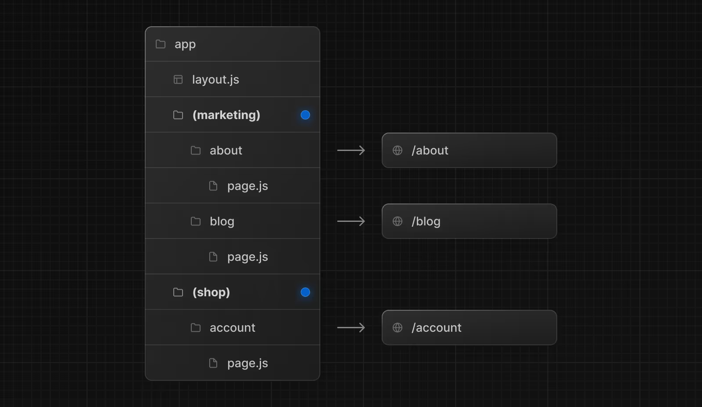
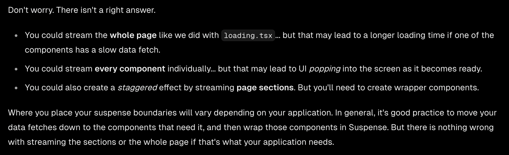

<h1> Tool Notes </h1>

# [Practical Next.js](https://nextjs.org/learn/dashboard-app) 
*These are the notes I took while following the tutorial, I think it will be suffificent to be acquainted with or revise the framework*

<h6> Creating a Next.js App </h6>

To create a Next.js app, run the following command:

```bash
npx create-next-app@latest
```

## Folder Structure

The project has the following folder structure:

- `/app:` Contains all the routes, components, and logic for your application, this is where you'll be mostly working from.
- `/app/lib`: Contains functions used in your application, such as reusable utility functions and data fetching functions.
- `/app/ui`: Contains all the UI components for your application, such as cards, tables, and forms.
- `/public`: Contains all the static assets for your application, such as images.
- `Config Files`: You'll also notice config files such as next.config.js at the root of your application. Most of these files are created and pre-configured when you start a new project using create-next-app. 

## CSS Styling
The most common approach is using CSS Modules or Tailwind CSS, as they provide good scoping and maintainability. 
I am more comfortable with CSS Modules so here is a short guide.

CSS Modules are locally scoped CSS files that prevent style conflicts by automatically creating unique class names. Here's a comprehensive breakdown:

1. File Naming Convention:

```css
/* The .module.css extension is crucial - it tells Next.js to process this as a CSS Module */
/* pages/Profile.module.css */
.container {
  max-width: 1200px;
  margin: 0 auto;
}
```

2. Basic Usage with Multiple Classes:

```css
/* Card.module.css */
.card {
  border-radius: 8px;
  padding: 16px;
  box-shadow: 0 2px 4px rgba(0,0,0,0.1);
}
.small { width: 200px; }
.medium { width: 400px; }
.large { width: 600px; }
```

```jsx
import styles from './Card.module.css'

function Card({ size = 'medium', children }) {
  return (
    <div className={`${styles.card} ${styles[size]}`}>
      {children}
    </div>
  )
}
```

3. Composition (Reusing Styles):

```css
/* Button.module.css */

.buttonBase {
  padding: 8px 16px;
  border-radius: 4px;
  border: none;
  cursor: pointer;
}

.primary {
  composes: buttonBase;
  background: #0070f3;
  color: white;
}

.secondary {
  composes: buttonBase;
  background: #fff;
  color: #0070f3;
  border: 1px solid #0070f3;

}

```

4. Global Selectors (When You Need Them):

```css
/* Header.module.css */

.nav {
  display: flex;
  align-items: center;
}

/* Target any child with class 'logo' */
.nav :global(.logo) {
  height: 40px;
}

/* Create a global utility class */

:global(.visually-hidden) {
  position: absolute;
  width: 1px;
  height: 1px;
  overflow: hidden;
}
```

5. Camel Case Properties Example:
```css
/* Layout.module.css */

.sideBar {
  background-color: #f5f5f5;
  min-height: 100vh;
}
.contentArea {
  padding: 20px;
  background-color: white;
}
```

```jsx
import styles from './Layout.module.css'

function Layout() {
  return (
    <div className={styles.sideBar}>  // Not styles.side-bar
      <main className={styles.contentArea}>
        {/* content */}
      </main>
    </div>
  )
}
```

6. Dynamic Styles with Media Queries:

```css
/* Card.module.css */
.container {
  display: grid;
  gap: 1rem;
}

@media (min-width: 768px) {
  .container {
    grid-template-columns: repeat(2, 1fr);
  }
}

@media (min-width: 1024px) {
  .container {
    grid-template-columns: repeat(3, 1fr);
  }
}

```

```jsx
import styles from './Card.module.css'

function CardGrid({ items }) {
  return (
    <div className={styles.container}>
      {items.map(item => (
        <div key={item.id} className={`
          ${styles.card}
          ${item.featured ? styles.featured : ''}
        `}>
          {item.content}
        </div>
      ))}
    </div>
  )
}
```
The main advantages of this approach become clear when working on larger projects:

- Your styles are truly modular and don't leak
- You can use semantic class names without worrying about collisions
- The generated class names include your component name, making debugging easier
- You get the full power of CSS while maintaining component-level scoping
- Build tools can optimize and remove unused styles

## Optimizing Fonts and Images

Next.js automatically optimizes fonts in the application when you use the next/font module. It downloads font files at build time and hosts them with your other static assets. This means when a user visits your application, there are no additional network requests for fonts which would impact performance.

Some ways to handle fonts:

1. Adding google fonts to your project

```jsx
import { Inter } from 'next/font/google'

// Initialize the font
const inter = Inter({
  subsets: ['latin'],
  weight: ['400', '700'],
  display: 'swap',
})

export default function RootLayout({ children }) {
  return (
    <html lang="en" className={inter.className}>
      <body>{children}</body>
    </html>
  )
}
```
2. Multiple Fonts 

```tsx
import { Inter, Lusitana } from 'next/font/google';
 
export const inter = Inter({ subsets: ['latin'] });
 
export const lusitana = Lusitana({
  weight: ['400', '700'],
  subsets: ['latin'],
});
```

```tsx
import AcmeLogo from '@/app/ui/acme-logo';
import { ArrowRightIcon } from '@heroicons/react/24/outline';
import Link from 'next/link';
import { lusitana } from '@/app/ui/fonts';
 
export default function Page() {
  return (
    // ...
    <p
      className={`${lusitana.className} text-xl text-gray-800 md:text-3xl md:leading-normal`}
    >
      <strong>Welcome to Acme.</strong> This is the example for the{' '}
      <a href="https://nextjs.org/learn/" className="text-blue-500">
        Next.js Learn Course
      </a>
      , brought to you by Vercel.
    </p>
    // ...
  );
}
```

Next.js provides the <Image /> component to display images.

- Preventing layout shift automatically when images are loading.
- Resizing images to avoid shipping large images to devices with a smaller viewport.
- Lazy loading images by default (images load as they enter the viewport).
- Serving images in modern formats, like WebP and AVIF, when the browser supports it.

```tsx
<Image
  src="/path/to/image.jpg"
  alt="Image description"
  className="hidden md:block"
  width={500}
  height={500}
  />
  ```
  The classname is set so that the class hidden to remove the image from the DOM on mobile screens, and md:block to show the image on desktop screens.

## Routing, Layouts, and Pages

Nested Routing: Next.js uses file-system routing where folders are used to create nested routes. Each folder represents a route segment that maps to a URL segment.

`page.tsx` is a special Next.js file that exports a React component, and it's required for the route to be accessible. In your application, you already have a page file: `/app/page.tsx`- this is the home page associated with the route `/`.

`layout.tsx` is a special Next.js file that exports a React component, this component is used to wrap the content of the page. In your application, you already have a layout file: `/app/layout.tsx`- this is the layout for the home page associated with the route `/`. One benefit of using layouts in Next.js is that on navigation, only the page components update while the layout won't re-render.

## Navigation between pages

Previosuly for navigation between pages, we used `<a>` tags but there's a full page refresh on each page navigation. Next.js provides the `<Link />` Component to link between pages in your application. `<Link>` allows you to do client-side navigation with JavaScript.

When using `<Link>`, you can pass it a `href` prop that specifies the URL to navigate to (similar to `<a>`).Furthermore, in production, whenever <Link> components appear in the browser's viewport, Next.js automatically prefetches the code for the linked route in the background. By the time the user clicks the link, the code for the destination page will already be loaded in the background, and this is what makes the page transition near-instant!

A common UI pattern is to show an active link to indicate to the user what page they are currently on. This can be done by using the hook `usePathname()` from `next/navigation` to check the current path and then conditionally render the link with the active class.

## Fetching data

Data can be fetched primarly by:
- API Layer: APIs are an intermediary layer between your application code and database. There are a few cases where you might use an API:
  - If you're using 3rd party services that provide an API.
  - If you're fetching data from the client, you want to have an API layer that runs on the server to avoid exposing your database secrets to the client.

- Database Queries: When you're creating a full-stack application, you'll also need to write logic to interact with your database. 
  - When creating your API endpoints, you need to write logic to interact with your database.
  - If you are using React Server Components (fetching data on the server), you can skip the API layer, and query your database directly without risking exposing your database secrets to the client.

Next.js by default uses Server Components, which means that data fetching happens on the server. There are a few benefits:
- Server Components support promises, providing a simpler solution for asynchronous tasks like data fetching. You can use async/await syntax without reaching out for useEffect, useState or data fetching libraries.
- Server Components execute on the server, so you can keep expensive data fetches and logic on the server and only send the result to the client.
- You can query the database directly without an additional API layer.

To utilize fetching data, use an async function in your page component and return the data as props. This is a common pattern in Next.js applications.

```tsx
export default async function Page() {
  const revenue = await fetchRevenue();
```
There are two things to be aware of:
- The data requests are unintentionally blocking each other, creating a request waterfall.
- By default, Next.js prerenders routes to improve performance, this is called Static Rendering. So if your data changes, it won't be reflected in your dashboard.

### Request waterfall and Parallel Data Fetching

A "waterfall" refers to a sequence of network requests that depend on the completion of previous requests. In the case of data fetching, each request can only begin once the previous request has returned data.

To avoid a request waterfall, you can fetch data in parallel. This means that you can fetch data from multiple sources at the same time, rather than waiting for one request to complete before starting the next one.

```tsx
export async function fetchCardData() {
  try {
    const invoiceCountPromise = sql`SELECT COUNT(*) FROM invoices`;
    const customerCountPromise = sql`SELECT COUNT(*) FROM customers`;
    const invoiceStatusPromise = sql`SELECT
         SUM(CASE WHEN status = 'paid' THEN amount ELSE 0 END) AS "paid",
         SUM(CASE WHEN status = 'pending' THEN amount ELSE 0 END) AS "pending"
         FROM invoices`;
 
    const data = await Promise.all([
      invoiceCountPromise,
      customerCountPromise,
      invoiceStatusPromise,
    ]);
    // ...
  }
}
```

## Static and Dynamic Rendering

### Static Rendering

With static rendering, data fetching and rendering happens on the server at build time (when you deploy) or when revalidating data. Whenever a user visits your application, the cached result is served. The benefits are:

- Faster Website: Static rendering generates HTML on the server, so users can view the page immediately without waiting for client-side JavaScript processing.
- Reduced Server Load: Static rendering reduces the number of requests to your server, as the HTML is generated once and cached for future requests.
- Improved SEO: Pre-rendered HTML improves search engine indexing and social media preview capabilities.

Static rendering is useful for UI with no data or data that is shared across users, such as a static blog post or a product page. It might not be a good fit for a dashboard that has personalized data which is regularly updated.

### Dynamic Rendering

With dynamic rendering, content is rendered on the server for each user at request time (when the user visits the page). The benefits are:

- Real-Time Data: Dynamic rendering allows you to fetch data at request time, so you can provide real-time data to users.
- User-Specific Content: Dynamic rendering allows you to personalize content based on user data, such as user-specific data or URL parameters.
- Request-Time Information - Dynamic rendering allows you to use request-time information, such as cookies, headers, and search parameters, to customize the content.

With dynamic rendering, your application is only as fast as your slowest data fetch.

## Streaming

Streaming is a data transfer technique that allows you to break down a route into smaller "chunks" and progressively stream them from the server to the client as they become ready. By streaming, you can prevent slow data requests from blocking your whole page. This allows the user to see and interact with parts of the page without waiting for all the data to load before any UI can be shown to the user.

There are 2 ways to implement streaming in Next.js:
- Page level with `loading.tsx` file
- Specific components with React Suspense

### Page Level Streaming

`loading.tsx` is a special Next.js file built on top of Suspense, it allows you to create fallback UI to show as a replacement while page content loads. So in a route folder, you can create a `loading.tsx` file to show a loading spinner or skeleton UI while the page content is loading. Next.js will automatically show the loading UI while the page content is being fetched. 

**Loading Skeleton UI**

It is a good practice to show a loading skeleton UI while the page content is being fetched. This provides a better user experience by indicating that the page is loading and preventing layout shifts.

**Routing Groups**

Route groups allow you to organize files into logical groups without affecting the URL path structure. When you create a new folder using parentheses (), the name won't be included in the URL path. So /dashboard/(overview)/page.tsx becomes /dashboard.



### Component Level Streaming

For granular control over streaming, you can use React Suspense to progressively render UI components. Suspense allows you to split your UI into smaller chunks and progressively render them as they become ready. This allows you to show parts of the page immediately while the rest loads in the background.

```tsx
import { Card } from '@/app/ui/dashboard/cards';
import RevenueChart from '@/app/ui/dashboard/revenue-chart';
import LatestInvoices from '@/app/ui/dashboard/latest-invoices';
import { lusitana } from '@/app/ui/fonts';
import { fetchLatestInvoices } from '@/app/lib/data';
import { Suspense } from 'react';
import { RevenueChartSkeleton } from '@/app/ui/skeletons';
 
export default async function Page() {
  const latestInvoices = await fetchLatestInvoices();

  return (
    <main>
      <h1 className={`${lusitana.className} mb-4 text-xl md:text-2xl`}>
        Dashboard
      </h1>
      <div className="mt-6 grid grid-cols-1 gap-6 md:grid-cols-4 lg:grid-cols-8">
        <Suspense fallback={<RevenueChartSkeleton />}>
          <RevenueChart />
        </Suspense>
        <LatestInvoices latestInvoices={latestInvoices} />
      </div>
    </main>
  );
}
```

We can use the `Suspense` component to wrap the `RevenueChart` component. The `fallback` prop `RevenueChartSkeleton` is used to show a loading skeleton UI while the `RevenueChart` component is being fetched. This allows you to show parts of the page immediately while the rest loads in the background. The data loading needs to be handled in the component itself.

### Grouping Components

Sometimes having staggered loading for multiple components can be confusing for users. To avoid this, you can group components that should load together. This way, the user sees the entire group of components load at once, rather than seeing them load one by one. Just wrap all the components that should load together in a single Suspense component.

**Where to use Streaming**



**Partial Pre-rendering**

Partial pre-rendering is a technique that allows you to pre-render parts of a page at build time and other parts at request time. This allows you to pre-render static content and fetch dynamic content at request time. This can be useful for pages with a mix of static and dynamic content. It is still in experimental mode but does not require code changes, I advise to hold off on using it until it is stable.

## Search and Pagination

Using URL search params to manage the search state. The benefits are:

- Bookmarkable and Shareable URLs: Users can bookmark or share search results with others.
- Server-Side Rendering and Initial Load: URL parameters can be directly consumed on the server to render the initial state
- Analytics and Tracking: URL parameters can be used to track user behavior and analytics without client-side logic

Next.js hooks that help:
- `useSearchParams`: Allows you to access the parameters of the current URL. For example, the search params for this URL /dashboard/invoices?page=1&query=pending would look like this: `{page: '1', query: 'pending'}`.
- `useRouter`: Enables navigation between routes within client components programmatically. 
- `usePathname`: Returns the current pathname of the URL. 

Here is an example of a Search component:

```tsx
'use client';

import { MagnifyingGlassIcon } from '@heroicons/react/24/outline';
import {  useSearchParams, usePathname, useRouter } from 'next/navigation';
import { useDebouncedCallback } from 'use-debounce';

export default function Search({ placeholder }: { placeholder: string }) {
    const searchParams = useSearchParams();
    const pathname = usePathname();
    const { replace } = useRouter();

    const handleSearch = useDebouncedCallback((term) => {
        console.log(`Searching... ${term}`);

        const params = new URLSearchParams(searchParams);
        if (term) {
            params.set('query', term);
        } else {
            params.delete('query');
        }
        replace(`${pathname}?${params.toString()}`);
    }, 300);

    return (
        <div className="relative flex flex-1 flex-shrink-0">
            <label htmlFor="search" className="sr-only">
                Search
            </label>
            <input
                className="peer block w-full rounded-md border border-gray-200 py-[9px] pl-10 text-sm outline-2 placeholder:text-gray-500"
                placeholder={placeholder}
                onChange={(e) => {
                    handleSearch(e.target.value);
                }}
                defaultValue={searchParams.get('query')?.toString()}
            />
            <MagnifyingGlassIcon
                className="absolute left-3 top-1/2 h-[18px] w-[18px] -translate-y-1/2 text-gray-500 peer-focus:text-gray-900"/>
        </div>
    );
}
```
`useDebouncedCallback` is a hook that debounces the search input. This means that the search function will only be called after the user has stopped typing for 300ms. This prevents the search function from being called on every keystroke, which can be resource-intensive. This can be installed using `npm install use-debounce`.

A similar approach can be used for pagination. Refer to the [tutorial](https://nextjs.org/learn/dashboard-app/adding-search-and-pagination#adding-pagination) for more information.

### [TODO] Mutating Data

Need to fill this in, refer to the [tutorial](https://nextjs.org/learn/dashboard-app/mutating-data)

# [Next.js](https://nextjs.org/)

I heard a lot about Next.js and thought my new project would be a good learning opportunity. So let's see what it is all about.

"Next.js is a React framework for building full-stack web applications. You use React Components to build user interfaces, and Next.js for additional features and optimizations."

Next.js basically optimizes our code and a lot of it is under the hood. The main features they mention are:
- Routing
- Rendering
- Data Fetching
- Styling
- Optimizations

Lets look a little deeper into each of these features.

## Rendering

Rendering converts the code you write into user interfaces. React and Next.js allow you to create hybrid web applications where parts of your code can be rendered on the server or the client. 

*Rendering Environments*: There are two environments where web applications can be rendered: the client and the server.

The client environment is the browser. The server refers to the computer in a data center that stores your application code, receives requests from a client, and sends back an appropriate response.

*Request Response Cycle*: The request-response cycle is the process of sending a request from a client to a server and receiving a response:

1. User Action
2. HTTP Request
3. Server Action
4. HTTP Response
5. Client
6. User Action


*Benefits of Server Rendering:*

1. Faster Data Fetching - Data fetching happens closer to the data source, reducing client requests and improving performance
2. Enhanced Security - Sensitive data and logic stay on the server, protecting tokens and API keys
3. Efficient Caching - Rendered results can be cached and reused across requests and users, improving performance and reducing costs
4. Better Performance - Reduces client-side JavaScript by moving non-interactive UI elements to server, helping users with slower devices/internet
5. Faster Initial Load - Generates HTML on server for immediate viewing, without waiting for client-side JavaScript processing
6. SEO & Social Sharing - Pre-rendered HTML improves search engine indexing and social media preview capabilities
7. Streaming Capability - Content can be split and streamed in chunks, allowing users to see parts of the page before complete rendering

*By default, Next.js uses Server Components. This allows you to automatically implement server rendering with no additional configuration, and you can opt into using Client Components when needed,*\``````    ``


3 subsets of server rendering:

1. Static Rendering (Default)
- Pages are rendered at build time
- Results are cached and can be served from CDN
- Ideal for content that's the same for all users (blogs, product pages)
- Best performance but least dynamic

2. Dynamic Rendering
- Pages are rendered at request time for each user
- Suitable for personalized content (user-specific data, URL parameters)
- Can mix cached and uncached data
- Automatically triggered by using dynamic APIs like:
  - cookies, headers, searchParams
  - connection, draftMode
  - unstable_noStore, unstable_after

3. Streaming
- Progressively renders UI from server in chunks
- Shows parts of the page immediately while rest loads
- Built into Next.js App Router
- Implemented using loading.js and React Suspense
- Balances performance with dynamic content needs

Key Point: Next.js automatically chooses the appropriate rendering strategy based on the APIs and features used in a route. Developers focus on data caching decisions rather than explicitly choosing rendering methods.

## Client Side Rendering Benefits

- Interactivity: Client Components can use state, effects, and event listeners, meaning they can provide immediate feedback to the user and update the UI.

- Browser APIs:  Client Components have access to browser APIs, like geolocation or localStorage.

*How to use Client Components*

To use Client Components, you can add the React "use client" directive at the top of a file, above your imports.

"use client" is used to declare a boundary between a Server and Client Component modules. This means that by defining a "use client" in a file, all other modules imported into it, including child components, are considered part of the client bundle.

```tsx
'use client'
 
import { useState } from 'react'
 
export default function Counter() {
  const [count, setCount] = useState(0)
 
  return (
    <div>
      <p>You clicked {count} times</p>
      <button onClick={() => setCount(count + 1)}>Click me</button>
    </div>
  )
}
```

*When to use Server and Client Components?*


## server-only

The 'server-only' package is a simple Next.js utility that helps prevent server code from being accidentally used in client components. When you import 'server-only', it throws a build-time error if that module is imported from a client component.

```tsx
// database.ts
import 'server-only';

export async function getData() {
  // Database operations here
}

// If this file gets imported by a client component,
// you'll get a build error:
// "You're importing a component that needs server-only features..."
```
It's particularly useful when you have utilities or functions that should never run on the client (like direct database access). Would you like me to explain more about when you might want to use this?


*Remember to `use client` for Context Providers because the provider needs to be rendered on the client*


*Routing*

NextJS moved on from a page router to a new App router. Refer to the [NextJS docs](https://nextjs.org/docs/app/building-your-application/routing) for more information.

*Tips*

I think the docs have a lot of useful information but best way to get started is to transition from React to NextJS with this [doc](https://nextjs.org/learn/react-foundations/from-react-to-nextjs)

Then complete the [tutorial](https://nextjs.org/learn/dashboard-appp) to be fully on board with the basics NextJS. Reading the docs like I did is a good way to get a greater understanding of the framework but it could also be too much information.


# [RestrictedPython](https://restrictedpython.readthedocs.io/en/latest/)

RestrictedPython is a tool that allows you to execute Python code in a restricted environment. It is useful for running untrusted code, such as code submitted by users in a web application.

RestrictedPython generally disallows calls to any library that is not explicit whitelisted. 


# [gVisor](https://gvisor.dev/)

What does it do?

gVisor provides a virtualized environment in order to sandbox containers. The system interfaces normally implemented by the host kernel are moved into a distinct, per-sandbox application kernel in order to minimize the risk of a container escape exploit.

## Approach

Previous approaches to isolation:

- Machine-level virtualization: This is the most secure form of isolation, but it is also the most resource-intensive. Each VM has its own kernel and is isolated from the host machine. This is the most secure form of isolation but it is also the most resource-intensive and slowest

- Rule-based isolation: This is a less resource-intensive approach. It uses rules to filter system calls. This is less secure than machine-level virtualization because it is difficult to define rules for arbitrary applications.

gVisor intercepts application system calls and acts as the guest kernel, without the need for translation through virtualized hardware. However, this comes at the price of reduced application compatibility and higher per-system call overhead.

## Different components of gVisor

- Sentry: This is the part of gVisor that intercepts system calls and emulates the Linux kernel. It is responsible for handling system calls and managing the application's memory.

- Gofer: This is the part of gVisor that manages file system access. It is responsible for translating file system operations into host kernel operations.


## runsc vs runc

- runc is the default container runtime for Docker and Kubernetes. It is a lightweight, portable container runtime that is designed to be compatible with the Open Container Initiative (OCI) specification.

- runsc is an executable that allows you to run sandboxed containers. It acts as the interface between container runtimes like Docker or Kubernetes and a sandbox environment. 


# [Gatsby](https://www.gatsbyjs.com/)
Gatsby is a React-based open source framework for creating websites. I think there is an use case for the Illinos NRS project because it is a static site generator with options to pull data from markdon and use something called MDX. 

Follow the [tutorial](https://www.gatsbyjs.com/docs/tutorial/getting-started/). 

Key points from the tutorial:

## Part 2 
- Gatsby automatically creates pages for React components that are the default export of files in the src/pages directory.

- If a user tries to visit the URL for a page that doesn’t actually exist, Gatsby will use the src/pages/404.js page component to display an error instead.

- Add a page title to your page. Gatsby lets you define a title and other document metadata with the Gatsby Head API. You have to export a component called Head from your page template to apply the metadata. Adding such metadata helps search engines like Google to better understand your site. For this tutorial you’ll only be adding titles to pages but you can also later add other metadata.

- Encompass the repeated parts of your site in a layout component. You can create a layout component that wraps around your page components to encompass the repeated parts of your site. This makes it easier to maintain your site and ensures that all pages have a consistent look and feel.
- Gatsby isn’t opinionated about what styling approach you want to use, but it works with CSS Modules by default.

## Part 3

- In Gatsby terms, a plugin is a separate npm package that you install to add extra features to your site.

To add a plugin to your site, you’ll use the following process:

1. Install the plugin by running npm install or yarn add.
2. Configure the plugin to your gatsby-config.js file.

*The gatsby-config.js file is a special file that Gatsby recognizes automatically. It’s where you add plugins and other site configuration.*

Takeaways:
- Using plugins saves you development time, since it’s faster to install and configure a plugin than it is to recreate the same functionality from scratch.
- The general process for using a plugin is to install it, configure it in your gatsby-config.js file, and then use it in your site as needed.


# [uv](https://github.com/astral-sh/uv) 

An extremely fast Python package and project manager, written in Rust.

**Installation**

```bash
# On Linux.
curl -LsSf https://astral.sh/uv/install.sh | sh

# On mac.
brew install uv
uv 
```

**Creating a virtual environment**

```bash
uv venv my_env
```

**Activating a virtual environment**

```bash
source my_env/bin/activate
```

**Deactivating a virtual environment**

```bash
deactivate
```

**Installing a package**

```bash
uv pip install numpy
```


# Streamlit

**Streamlit** is a Python library that allows you to create web applications with Python code. It is a great tool for creating dashboards and visualizations.

Install with pip:

```bash
pip install streamlit
```

You can run a Streamlit app with the following command:

```bash
streamlit run app.py
```

or 

```bash
python -m streamlit run app.py
```

During development, similar to Javascript development, the changes are automatically reflected in the browser.

Streamlit is a reactive framework. When the user interacts with the app, the app is re-run from top to bottom. This is different from traditional web frameworks where the server sends the data to the client. Also when you modify the code, the app is re-run.


To display data, we can use either magic commands or the `st.write()` function. The `st.write()` function is a generic function that can display any data type. 

It has support for dataframes, charts and maps. It also has widgets for user input.
The thing is there is a lack of flexibility in the layout but it is amazing for quick charts and stuff. I think it is a great tool for Clowder where we can provide support for data from clowder right in the dashboard. It has features like caching to perform when loading data.


It has support for custom componenets, so though there is no integration with Openlayers, we can create a custom component to display Openlayers maps. 

It also has a testing framework built in.

Here is an [App model summary](https://docs.streamlit.io/get-started/fundamentals/summary)

Overall the dashboard is very easy to use and is a great tool for creating dashboards and visualizations. It is quick and easy to use.

I was able to create the following dashboard through this [tutorial](https://docs.streamlit.io/get-started/tutorials/create-an-app) with just 36 lines of code. It includes loading data, optionally displaying data, creating a chart and a map. The data is loaded from an online source and cached for performance.


