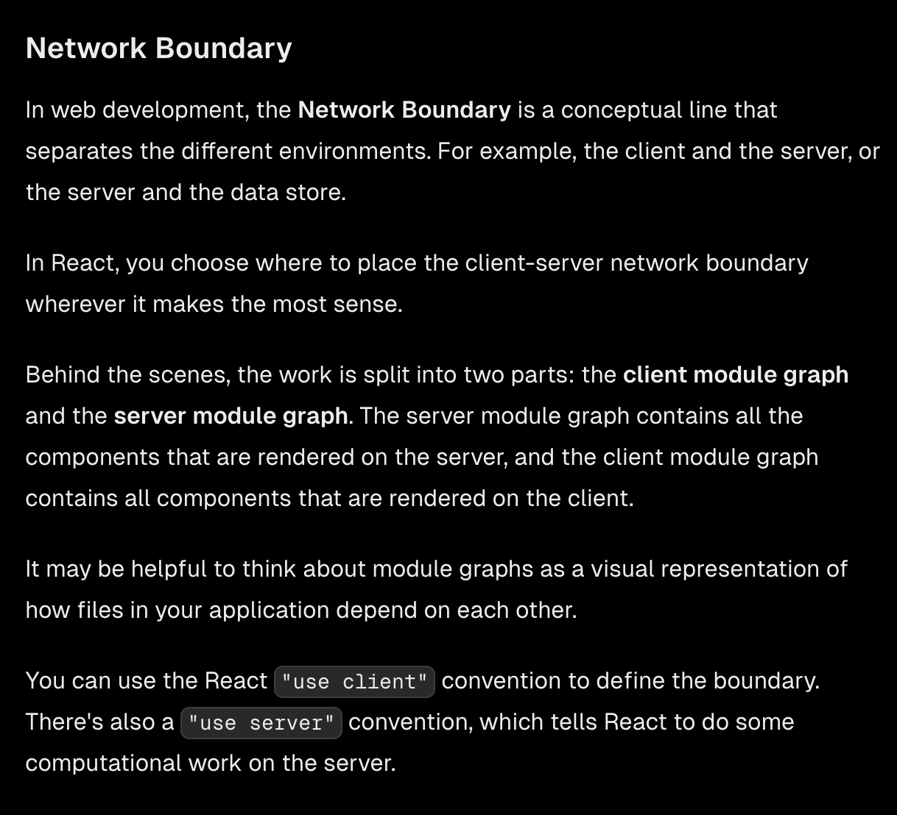
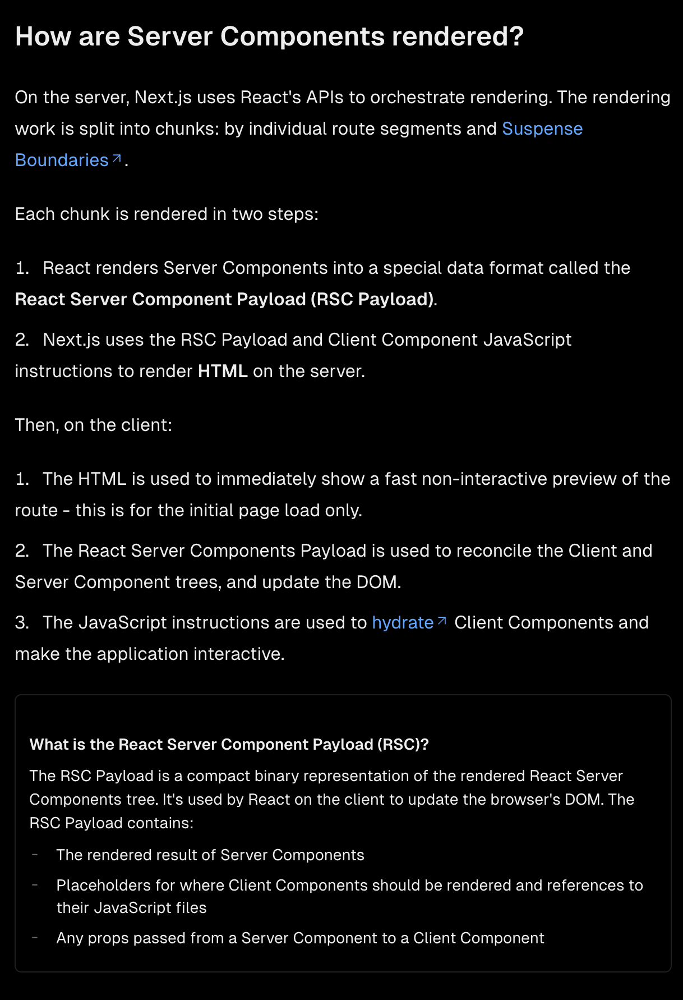
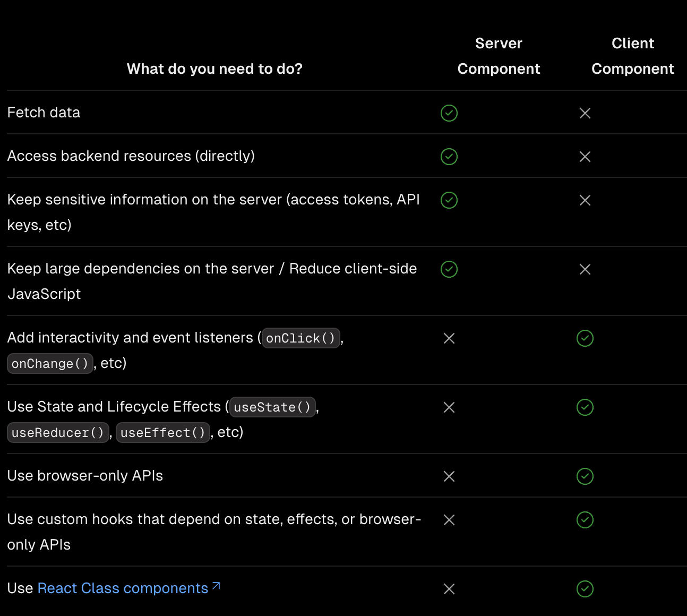

# Tool Notes

## [Next.js](https://nextjs.org/)

I heard a lot about Next.js and thought my new project would be a good learning opportunity. So let's see what it is all about.

"Next.js is a React framework for building full-stack web applications. You use React Components to build user interfaces, and Next.js for additional features and optimizations."

Next.js basically optimizes our code and a lot of it is under the hood. The main features they mention are:
- Routing
- Rendering
- Data Fetching
- Styling
- Optimizations

Lets look a little deeper into each of these features.

### Rendering

Rendering converts the code you write into user interfaces. React and Next.js allow you to create hybrid web applications where parts of your code can be rendered on the server or the client. 

*Rendering Environments*: There are two environments where web applications can be rendered: the client and the server.

The client environment is the browser. The server refers to the computer in a data center that stores your application code, receives requests from a client, and sends back an appropriate response.

*Request Response Cycle*: The request-response cycle is the process of sending a request from a client to a server and receiving a response:

1. User Action
2. HTTP Request
3. Server Action
4. HTTP Response
5. Client
6. User Action



*Benefits of Server Rendering:*
1. Faster Data Fetching - Data fetching happens closer to the data source, reducing client requests and improving performance

2. Enhanced Security - Sensitive data and logic stay on the server, protecting tokens and API keys

3. Efficient Caching - Rendered results can be cached and reused across requests and users, improving performance and reducing costs

4. Better Performance - Reduces client-side JavaScript by moving non-interactive UI elements to server, helping users with slower devices/internet

5. Faster Initial Load - Generates HTML on server for immediate viewing, without waiting for client-side JavaScript processing

6. SEO & Social Sharing - Pre-rendered HTML improves search engine indexing and social media preview capabilities

7. Streaming Capability - Content can be split and streamed in chunks, allowing users to see parts of the page before complete rendering

**By default, Next.js uses Server Components. This allows you to automatically implement server rendering with no additional configuration, and you can opt into using Client Components when needed,**



3 subsets of server rendering:

1. Static Rendering (Default)

- Pages are rendered at build time

- Results are cached and can be served from CDN

- Ideal for content that's the same for all users (blogs, product pages)

- Best performance but least dynamic

2. Dynamic Rendering

- Pages are rendered at request time for each user

- Suitable for personalized content (user-specific data, URL parameters)

- Can mix cached and uncached data

- Automatically triggered by using dynamic APIs like:

  - cookies, headers, searchParams

  - connection, draftMode

  - unstable_noStore, unstable_after

3. Streaming

- Progressively renders UI from server in chunks

- Shows parts of the page immediately while rest loads

- Built into Next.js App Router

- Implemented using loading.js and React Suspense

- Balances performance with dynamic content needs

Key Point: Next.js automatically chooses the appropriate rendering strategy based on the APIs and features used in a route. Developers focus on data caching decisions rather than explicitly choosing rendering methods.

*Client Side Rendering Benefits*

- Interactivity: Client Components can use state, effects, and event listeners, meaning they can provide immediate feedback to the user and update the UI.

- Browser APIs:  Client Components have access to browser APIs, like geolocation or localStorage.

*How to use Client Components*

To use Client Components, you can add the React "use client" directive at the top of a file, above your imports.

"use client" is used to declare a boundary between a Server and Client Component modules. This means that by defining a "use client" in a file, all other modules imported into it, including child components, are considered part of the client bundle.

```tsx
'use client'
 
import { useState } from 'react'
 
export default function Counter() {
  const [count, setCount] = useState(0)
 
  return (
    <div>
      <p>You clicked {count} times</p>
      <button onClick={() => setCount(count + 1)}>Click me</button>
    </div>
  )
}
```

*When to use Server and Client Components?*


*server-only*

The 'server-only' package is a simple Next.js utility that helps prevent server code from being accidentally used in client components. When you import 'server-only', it throws a build-time error if that module is imported from a client component.

```tsx
// database.ts
import 'server-only';

export async function getData() {
  // Database operations here
}

// If this file gets imported by a client component,
// you'll get a build error:
// "You're importing a component that needs server-only features..."
```
It's particularly useful when you have utilities or functions that should never run on the client (like direct database access). Would you like me to explain more about when you might want to use this?

### Routing

NextJS moved on from a page router to a new App router. 

## [RestrictedPython](https://restrictedpython.readthedocs.io/en/latest/)

RestrictedPython is a tool that allows you to execute Python code in a restricted environment. It is useful for running untrusted code, such as code submitted by users in a web application.

RestrictedPython generally disallows calls to any library that is not explicit whitelisted. 


## [gVisor](https://gvisor.dev/)

What does it do?

gVisor provides a virtualized environment in order to sandbox containers. The system interfaces normally implemented by the host kernel are moved into a distinct, per-sandbox application kernel in order to minimize the risk of a container escape exploit.

### Approach

Previous approaches to isolation:

- Machine-level virtualization: This is the most secure form of isolation, but it is also the most resource-intensive. Each VM has its own kernel and is isolated from the host machine. This is the most secure form of isolation but it is also the most resource-intensive and slowest

- Rule-based isolation: This is a less resource-intensive approach. It uses rules to filter system calls. This is less secure than machine-level virtualization because it is difficult to define rules for arbitrary applications.

gVisor intercepts application system calls and acts as the guest kernel, without the need for translation through virtualized hardware. However, this comes at the price of reduced application compatibility and higher per-system call overhead.

**Different components of gVisor**

- Sentry: This is the part of gVisor that intercepts system calls and emulates the Linux kernel. It is responsible for handling system calls and managing the application's memory.

- Gofer: This is the part of gVisor that manages file system access. It is responsible for translating file system operations into host kernel operations.


**runsc vs runc**

- runc is the default container runtime for Docker and Kubernetes. It is a lightweight, portable container runtime that is designed to be compatible with the Open Container Initiative (OCI) specification.

- runsc is an executable that allows you to run sandboxed containers. It acts as the interface between container runtimes like Docker or Kubernetes and a sandbox environment. 


## [Gatsby](https://www.gatsbyjs.com/)
Gatsby is a React-based open source framework for creating websites. I think there is an use case for the Illinos NRS project because it is a static site generator with options to pull data from markdon and use something called MDX. 

Follow the [tutorial](https://www.gatsbyjs.com/docs/tutorial/getting-started/). 

Key points from the tutorial:

**Part 2** 
- Gatsby automatically creates pages for React components that are the default export of files in the src/pages directory.

- If a user tries to visit the URL for a page that doesn’t actually exist, Gatsby will use the src/pages/404.js page component to display an error instead.

- Add a page title to your page. Gatsby lets you define a title and other document metadata with the Gatsby Head API. You have to export a component called Head from your page template to apply the metadata. Adding such metadata helps search engines like Google to better understand your site. For this tutorial you’ll only be adding titles to pages but you can also later add other metadata.

- Encompass the repeated parts of your site in a layout component. You can create a layout component that wraps around your page components to encompass the repeated parts of your site. This makes it easier to maintain your site and ensures that all pages have a consistent look and feel.
- Gatsby isn’t opinionated about what styling approach you want to use, but it works with CSS Modules by default.

**Part 3**

- In Gatsby terms, a plugin is a separate npm package that you install to add extra features to your site.

To add a plugin to your site, you’ll use the following process:

1. Install the plugin by running npm install or yarn add.
2. Configure the plugin to your gatsby-config.js file.

*The gatsby-config.js file is a special file that Gatsby recognizes automatically. It’s where you add plugins and other site configuration.*

Takeaways:
- Using plugins saves you development time, since it’s faster to install and configure a plugin than it is to recreate the same functionality from scratch.
- The general process for using a plugin is to install it, configure it in your gatsby-config.js file, and then use it in your site as needed.


## [uv](https://github.com/astral-sh/uv) 

An extremely fast Python package and project manager, written in Rust.

**Installation**

```bash
# On Linux.
curl -LsSf https://astral.sh/uv/install.sh | sh

# On mac.
brew install uv
uv 
```

**Creating a virtual environment**

```bash
uv venv my_env
```

**Activating a virtual environment**

```bash
source my_env/bin/activate
```

**Deactivating a virtual environment**

```bash
deactivate
```

**Installing a package**

```bash
uv pip install numpy
```


## Streamlit

**Streamlit** is a Python library that allows you to create web applications with Python code. It is a great tool for creating dashboards and visualizations.

Install with pip:

```bash
pip install streamlit
```

You can run a Streamlit app with the following command:

```bash
streamlit run app.py
```

or 

```bash
python -m streamlit run app.py
```

During development, similar to Javascript development, the changes are automatically reflected in the browser.

Streamlit is a reactive framework. When the user interacts with the app, the app is re-run from top to bottom. This is different from traditional web frameworks where the server sends the data to the client. Also when you modify the code, the app is re-run.


To display data, we can use either magic commands or the `st.write()` function. The `st.write()` function is a generic function that can display any data type. 

It has support for dataframes, charts and maps. It also has widgets for user input.
The thing is there is a lack of flexibility in the layout but it is amazing for quick charts and stuff. I think it is a great tool for Clowder where we can provide support for data from clowder right in the dashboard. It has features like caching to perform when loading data.


It has support for custom componenets, so though there is no integration with Openlayers, we can create a custom component to display Openlayers maps. 

It also has a testing framework built in.

Here is an [App model summary](https://docs.streamlit.io/get-started/fundamentals/summary)

Overall the dashboard is very easy to use and is a great tool for creating dashboards and visualizations. It is quick and easy to use.

I was able to create the following dashboard through this [tutorial](https://docs.streamlit.io/get-started/tutorials/create-an-app) with just 36 lines of code. It includes loading data, optionally displaying data, creating a chart and a map. The data is loaded from an online source and cached for performance.


