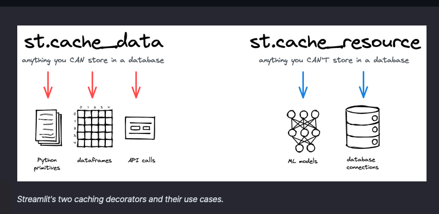

# Tool Notes


## [Gatsby](https://www.gatsbyjs.com/)

Gatsby is a React-based open source framework for creating websites. I think there is an use case for the Illinos NRS project because it is a static site generator with options to pull data from markdon and use something called MDX. 

Follow the [tutorial](https://www.gatsbyjs.com/docs/tutorial/getting-started/). 


## [uv](https://github.com/astral-sh/uv) 

An extremely fast Python package and project manager, written in Rust.

**Installation**

```bash
# On Linux.
curl -LsSf https://astral.sh/uv/install.sh | sh

# On mac.
brew install uv
uv 
```

**Creating a virtual environment**

```bash
uv venv my_env
```

**Activating a virtual environment**

```bash
source my_env/bin/activate
```

**Deactivating a virtual environment**

```bash
deactivate
```

**Installing a package**

```bash
uv pip install numpy
```


## Streamlit

**Streamlit** is a Python library that allows you to create web applications with Python code. It is a great tool for creating dashboards and visualizations.

Install with pip:

```bash
pip install streamlit
```

You can run a Streamlit app with the following command:

```bash
streamlit run app.py
```

or 

```bash
python -m streamlit run app.py
```

During development, similar to Javascript development, the changes are automatically reflected in the browser.

Streamlit is a reactive framework. When the user interacts with the app, the app is re-run from top to bottom. This is different from traditional web frameworks where the server sends the data to the client. Also when you modify the code, the app is re-run.


To display data, we can use either magic commands or the `st.write()` function. The `st.write()` function is a generic function that can display any data type. 

It has support for dataframes, charts and maps. It also has widgets for user input.
The thing is there is a lack of flexibility in the layout but it is amazing for quick charts and stuff. I think it is a great tool for Clowder where we can provide support for data from clowder right in the dashboard. It has features like caching to perform when loading data.



It has support for custom componenets, so though there is no integration with Openlayers, we can create a custom component to display Openlayers maps. 

It also has a testing framework built in.

Here is an [App model summary](https://docs.streamlit.io/get-started/fundamentals/summary)

Overall the dashboard is very easy to use and is a great tool for creating dashboards and visualizations. It is quick and easy to use.

I was able to create the following dashboard through this [tutorial](https://docs.streamlit.io/get-started/tutorials/create-an-app) with just 36 lines of code. It includes loading data, optionally displaying data, creating a chart and a map. The data is loaded from an online source and cached for performance.


