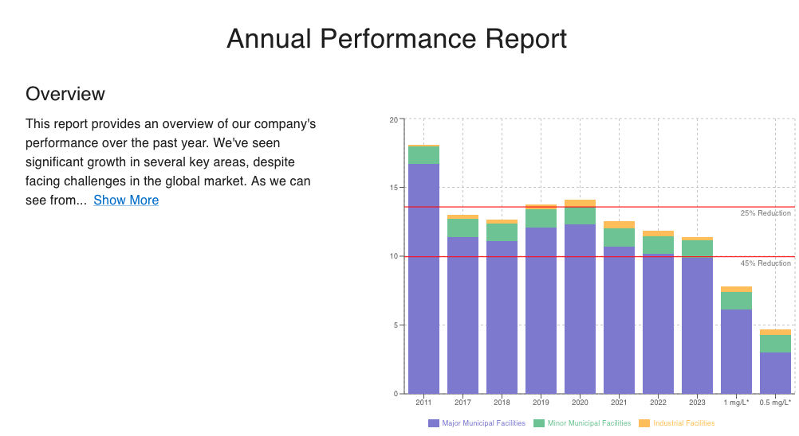
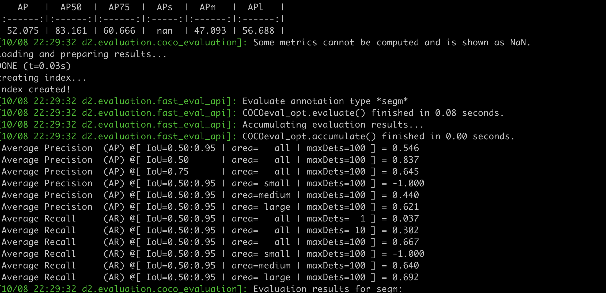
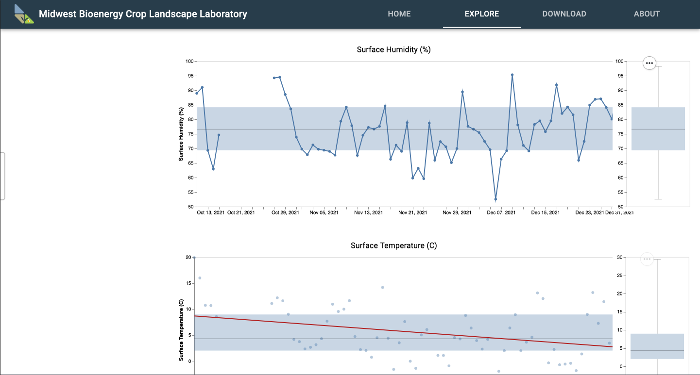

# My Worklog

## Project Boards

- [**Geostream Projects**](https://github.com/orgs/geostreams/projects/7)
- [**IBM HPHC**](https://github.com/orgs/clowder-framework/projects/3)
- [**Illinois NRS Dashboard**](https://github.com/orgs/geostreams/projects/9)

## October 14th
**IBM HPHC**
- Researched on gVisor and Restricted Python

**Misc**

Read papers:
 - How to Read a Paper
 - How to Present a Paper in Theoretical Computer Science

## October 10th

**GLTG**
- Write script to add yield to the station data json

**IBM HPHC**

- Researched on infrastructure of different companies to see how we can run code on a secure environment with a focus on gVisor
- Created a blog post to document the research and the problems we are trying to solve
- Created a roadmap for the project

**Misc**
- Going through past self-evaluation to discuss in the 1-1 meeting with Luigi
- Fill up the 1-1 meeting docs

## October 9th

**GLTG**

- Completed Jong's wireframe for home page 
-  Deployed to production

**Illinois NRS**

- Created stacked bar chart with recharts and remaining layout

- Created notes for next meeting to get clarification on report

## October 8th

**GLTG**

Updated the watershed scripts and updated the watersheds in the current map. Task took slightly longer than expected as there were small bugs that werent there before

Rerouted - /summary is used for trend dashboard, /nutrient-trends is now used for the trend dashboard and removed the use of hashtag from the url

Made notes on the GLTG dashboard wireframes

**Illinois NRS**

- Get started with making charts a layout for the website using MUI

**HPHC**

- Rob fixed the taiga mount and I was able to uninstall the wrong version of torch and pytorch and install the correct version. Started a run of the GPU script
`python train_net.py --config-file configs/mask_rcnn_vitdet.py --num-gpus 1 --dataset iwp`

## October 7th 

**IBM HPHC**
Run the code Amal provided on the NCSA GPU VM

**GLTG**

Met with Alejandra to discuss new updates to the watershed basin, she will upload some new shape files which means we will have to recreate a new watershed layer for the map.

## October 6th

**Illinois NRS**
Ruled out Gatsby for the Illinois NRS project, as it is not a good fit for the project. The project's future goals are to have a dynamic dashboard that can be updated with new data and Gatsby is more suited for static sites. There could be a workaround by using Gatsby for the static pages and then using React for the dynamic pages but it would be a lot of work.

## October 5th

**Geostreams 3**

Successfully, connected local smartfarm to geostreams3, I am able to even visualize sensor data though there are small glitches like when I reload the page, the graphs disappear. The cause of the error was that the sensor serializer was returning the parameter as a list of lists as it was passing each stream's parameter as a list.

## October 4th

**Illinois NRS**

- Meeting with Trevor to discuss the data and goals of the Illinois NRS dashboard. 

## October 3rd

**GLTG**

Biweekly meeting, went through the new changes for the trend dashboard:
 - The addition of a new parameter yield. This means a new radio button, with a new chart and changes to script to calculate yield by using area. Created github task 

**Illinois NRS**

- Gatsby setup, read through the docs and set up a sandbox project to go through it. 
- Read through Chapter 5 and made notes to have a better understanding for meeting with Trevor about data

## October 2nd

**HPHC**
- Compile report for meeting and reorganize project board
- Meeting takeaways:
  - Kueue is a good option for checking out how to queue jobs
  - A focus on autoscale 

**GlTG**

- Improved the aesthetics of the sidebar by opening one of the accordion tables, removed redundant components. 

- Implement Greg's [changes](https://github.com/geostreams/gltg/issues/116) to the Trend Dashboard
  - Reran scripts to get new JSON files as there is an unit change
  - Put a hold on the rest of the changes, as there are some points I need to clear up at tomorrow's meeting

**Misc**

- Used uv to install a sandbox environment for streamlit, it was super fast. Gonna try using everywhere else now

**Illinois NRS**
- Pivoting to using Gatsby as it is a more static site than a dashboard, read up on docs 

## October 1st 

**HPHC** 

- Debugging script while running on K8 Cluster

**Illinois NRS Dashboard**

- Created google doc to keep track of notes for project and had follow up meeting with Laura

**Misc**

- Attended round table talk on the new hip replacement for pip called [uv](https://astral.sh/blog/uv)

- Completed Ethics training 2024

## September 30th

**Illinois NRS Dashboard**

- Had first meeting with Laura and Joan to discuss the Illinois Dashboard Project. Meeting went well, following takeaways:
  -  Joan showed us a timeline of the project and the different phases that are planned
  - There is a lot of similarites to the old Green Infrastructure project, so going through the codebase could be helpful
  -  The project so far has 4 dashboards but it is a tentative number and can be changed
  - A lot of the data in the report is statewide but dashboard might require us to focus by county, practices and HUC
  - There is a number of spreadsheets from different sources which should be normalized to a single database and this format is already being worked on by Joan
  - A number of scripts would required for conversions such as lat long to HUC, etc 
  - I pushed for a couple of wireframes so we can get started with the layout of the dashboard and compare different navigation options
  - The design files might have some useful styling information that can be used for the dashboard
  - Going to have a followup huddle with Laura to clarify some of the points and get started on the project

**HPHC**

- Run Kuberay workflows on the PDG cluster and gather results

- Write scripy for finetuning bert model on yelp classifican using TorchTrainer for K8 Ray Cluster

**Misc**

- Send out email confirming travel plans to India

## September 27th
**HPHC**
- I finally managed to get the vit_Repository into the GPU VM. I had to git clone to my local and scp to the taiga. I also had to move my conda package installation folder `.conda` to the taiga as the system is running out of space. To do it use `conda config --add pkgs_dirs /new/path/to/store/conda_pkgs`. 

**Geostreams3**
- Meetings with Rashmil and Max to discuss the Geostreams3 project. Discussed the sending of emails and how to create an API that takes in a circle or polygon and returns the sensors within that area. Created [issue](https://github.com/geostreams/geostreams3/issues/75)

- Create [PR](https://github.com/geostreams/geostreams3/pull/76) for the get sensors in Polygon API 

**Illinois Dashboard**

- Experiment with [streamlit](https://streamlit.io/) to see if it can be used for the Illinois Dashboard.

**Misc**
- Opening other pages in my gitbook for a more comprehensive report on project tasks.  

## September 26th
**GLTG**
-  Trend Dashboard - Improvements to UI expereience, re render of table causes loss of User's selection. Working on a fix for this. Merged branch to the new trend dashboard PR

**HPHC**
- Reading on more examples of KubeRay while trying to run the hugging face extractor on KubeRay. 
- RayServe and RayJob seem to be the standard ways to serve and train. Rare examples of using RayCluster by itself. The [one](https://docs.ray.io/en/latest/cluster/kubernetes/user-guides/rayserve-dev-doc.html) is see is to set one up to develop a RayServe script.

## September 25th
**HPHC**
- Going through [Tutorial](https://docs.ray.io/en/latest/cluster/getting-started.html) on Kuberay to prepare on using MCAD for PDG cluster

- *Note - Useful [instructions](https://docs.ray.io/en/latest/cluster/kubernetes/k8s-ecosystem/prometheus-grafana.html#kuberay-prometheus-grafana) on adding Prometheus or Grafana to Kuberay*

- Trying to run the hugging face extractor on KubeRay. Set up PDG cluster on my computer.
  - Ran into memory issues when running the extractor, super close to getting it to work

**Illinois Dashboard**
- Compiled short list of charts from the report that might be needed for the dashboard in the [google doc](https://docs.google.com/document/d/1dUPDMBBk3ZLDZn3wwInLj3j2IhqzzuRCeKauPPd5uC4/edit)

**GLTG**
- Completed the [GLTG Dashbard changes](https://github.com/geostreams/gltg/issues/115) suggested by Alejandra

## September 24th

**Illinois Dashboard**
- Had meeting with Laura and then Jong, about project. Main takeaways:
  - Project deadline October 2025, with development to start early
  - Single webpage app
  - List of stuff to do:
    - [X] Create a [Github Project]((https://github.com/orgs/geostreams/projects/9)) to track the tasks
    - [X] Create a [private repository](https://github.com/geostreams/illinois-nrs-dashboard)
    - [ ] Go through report to get an idea of the required chart library
    - [ ] Create headers, sidebars and a basic layout once wireframes are received

**GLTG**
- State portal data sources has been provided in [doc](https://docs.google.com/document/d/1e-60FORWajNJpBh2N9ErxGo9ynQVPXHXIWBugWqCXqI/edit), some changes still needed but loaded the ones that are available
- Note - Trend narrative to be provided in 2 weeks

**HPHC**
- Scheduled meeting with AMAL to discuss the ViT-Sandbox on Friday
 

## September 23rd
**GLTG**
- Created different tasks for GLTG Trends Dashboard
- Worked on the [GLTG Dashbard changes](https://github.com/geostreams/gltg/issues/115) suggested by Alejandra

**Illinois Dashboard**
- Set up meeting with Laura tomorrow to discuss the Illinois Dashboard project that is starting early October
- Created [Google Doc](https://docs.google.com/document/d/1dUPDMBBk3ZLDZn3wwInLj3j2IhqzzuRCeKauPPd5uC4/) to track notes and plans for the dashboard

**HPHC**
- Going through [Tutorial](https://docs.ray.io/en/latest/cluster/getting-started.html) on Kuberay to prepare on using MCAD for PDG cluster

## September 22nd
**HPHC**
- Second time trying to git clone and we should suggest Amal to change the repo to a git LFS system
- Using VS server to run jupyter notebooks in sd-gpu, the drivers it installare much more lightweight and I even get github copilot
- Ray dataset with detectron not going accord to plan, issues coming up. It is slower than running normally
- I have an implementation using basic ray functions, the time benchmarks suggest not using Ray is faster but this could change in a multi-gpu system

*Geostreams3*
- Create PR for keycloak setup using realm settings (includes client settings as well)
- Created new issues to tackle in geostreams3 such as Keycloak sendign email
- Meeting with Rashmil on Friday to discuss

## September 19
**HPHC**
- Running Object Detection Notebook sucessfully on NCSA GPU (Small changes such as loading data locally with curl instead of bucket download needed to be done)
- Running Detectron 2 on NCSA GPU VM
  Notes:
  - Needed to install g++ , [used](https://stackoverflow.com/a/69485927) `conda install -c conda-forge cxx-compiler`
  - Created notebook to download specifc parts of COCO dataset. This was an useful [reference](https://pypi.org/project/CocoDataset/)
- Running vit-sandbox on NCSA GPU
  Notes:
  - There is a lot of data, so I cloned it to taiga and probably use symlinks
  - The thing is so large it is getting stuck
  - Slight chance, I killed the sd-gpu machine

  

## September 17 
**GLTG** 
* Draft of Sidebar is done

**HPHC**
* Learning to use Ray Core and Ray Train
* Get to setting up Ray Cluster soon

## Aug 27, 2024 - Aug 28, 2024

**GLTG** 
* Trends Dashboard Sidebar
  * Trends Table - The table now is available for all parameters, the only thing left is the interaction between map and table. 

* Geostreams
 * Hash and store the API keys for user. Still need to provide username
 * Debugging geostream scripts with Max

**HPHC**
* Screen recorded the Segment Anything extractor 

**Reading**
  * Reading on Kubernetes 

**Misc**
* Complete Cybersecurity work

## Aug 26, 2024

**GLTG**
* Trends Dashboard Sidebar
  * Trends Table - Dynamically loads the GeoJson files, a hack I had to use was to use the fetch API to get the geojson data, the webpack config currently was loading them as URLS which was needed for the vector layer creation on the map

**Geostreams3**
  * The authentication app now has another API to generate API keys for logged in users, it was done using the secrets library of python, it is currently stored plainly in the database but will spend time to encrypt and store it if possible, the encryption key can be stored in settings

## Aug 21, 2024 - Aug 22, 2024

**HPHC**
* Segment Anything Extractor
  * Bug in Image annotator was caught, image coordinates were in SVG space, needed to be converted to image
  * Bug was fixed and minor changes to extractor, the segment anything extractor is working perfectly

**GLTG**
* Basic layout of Trend Tables created

## Aug 20, 2024

*Geostreams3*
* Since there was no radiant available, I put all my focus on Geostreams3, corrected the basic front end UI to login, signup and  get the token using React Contexts
* Taking a slight detour to see if I can use keycloak, one last time. 
* Keycloak method is bearing fruition, I am able to login and validate through Django. For the purpose of sign up, I think my plan is to use the keycloak frontend to create users. 

## Aug 15, 2024

**GLTG** 
* Productive meeting with Max to discuss future steps with GLTG
* Making progress with issue [#108](https://github.com/geostreams/gltg/issues/108), this issue needs to be fixed in order to imrove efficiency and avoid rewriting code for new trend dashboard

## Aug 14, 2024

**HPHC**

* Segment Anything Extractor
  * Fixed bug regarding reading parameters
  * Clowder broke, needed to rebuild
  * Fixed mistake with extractor-info.json that caused extractor to run on all files
  * Clowder broke again before I can check the annotation tool

**GLTG**

* Cleaned up `gltg_scripts` repo with small documentation for easier use

## Aug 13, 2024

**GLTG**

* [PR](https://github.com/geostreams/gltg/pull/105) that modifies data to relfect new units for Load and conditional rendering of graph for improved UI

